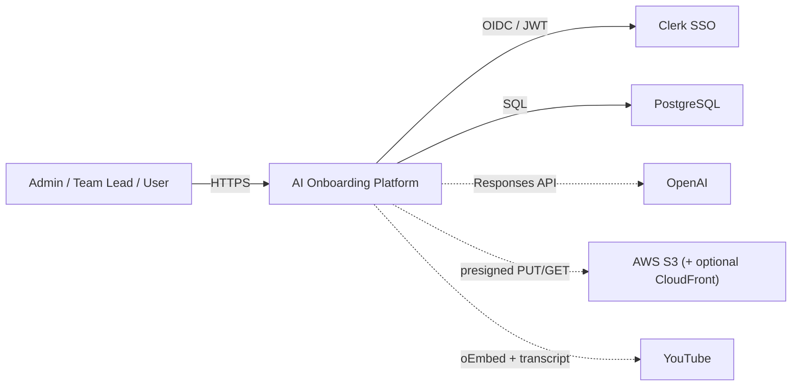
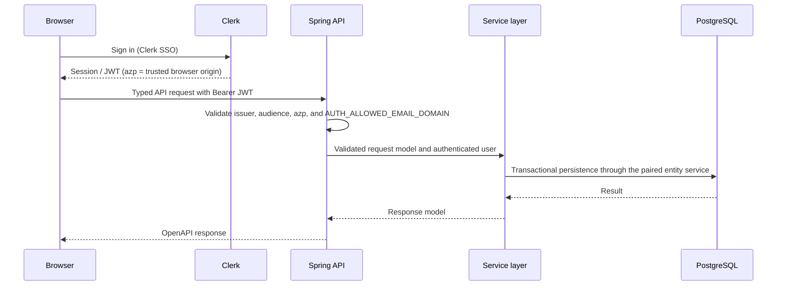

# Architecture Overview

Project facts for this repository. `.claude/` holds the reusable AIAE
engineering contract; this file holds what is specific to **AI Onboarding
Platform** and must not be copied into the rule tree.

## Document status

- Owner: engineering (AIAE convergence migration)
- Lifecycle phase: MVP
- Last verified against: `migration` @ P6 (2026-08-11)
- Verification evidence: `bash scripts/local-verify.sh`
- Cache status: enabled
- MVP usage telemetry: enabled during MVP

## Identity

- Product: **AI Onboarding Platform** — Spring Boot backend + React frontend.
- Backend production package root: **`com.aidigital.aionboarding.*`**. There is
  exactly one root; do not introduce a second.

## Backend modules

| Module | Role |
|---|---|
| `backend/domain` | JPA entities and Spring Data repositories |
| `backend/migrations` | Liquibase changelogs (renamed from `backend/db` to match the AIAE standard module name) |
| `backend/service` | business orchestration, entity services, validators |
| `backend/application` | Spring Boot runtime, security, controllers, OpenAPI implementations |
| `backend/external-services` | outbound integrations |
| `backend/event-logging-to-db-feature` | MVP usage-event logging to PostgreSQL |
| `backend/observability` | reusable outbound-call metrics (`ExternalClientMetricsInterceptor`, `ExternalCallTimer`) |
| `backend/cache-management` | distributed cache-invalidation outbox, registry, and scheduled poller (P6) |
| `backend/config` | shared configuration module |

Liquibase changelogs live at
`backend/migrations/src/main/resources/db/changelog/`. The Spring property is
`classpath:db/changelog/db.changelog-master.xml` — a classpath resource, so it is
unaffected by the module directory name. All 14 changeSets in
`1.0.0/db.version-master.xml` declare `preConditions` with `onFail="MARK_RAN"`,
plus one further changeSet (P6) in `changes/0003-cache-invalidation.xml`,
included from `db.changelog-master.xml` alongside `1.0.0/db.version-master.xml`.

## Product and system context



Admins and team leads build roadmaps, lessons, and materials, then assign them
to teams/groups; employees (`User`) work through the content and their
progress is tracked on dashboards. Lessons and quizzes can be AI-generated
from source materials, and each lesson has an AI assistant learners can ask
questions. The frontend is a React SPA (`BrowserRouter`) backed by this Spring
Boot API — see *Deployment / runtime constraints* below for the SPA-fallback
contract that keeps deep links working.

## Product-specific evidence

- Product capability: AI-assisted onboarding and continuous learning —
  roadmaps, AI-generated lessons/quizzes, a per-lesson AI assistant, team/group
  assignment, and progress dashboards.
- Primary users: Admin, Team Lead, and User (employee), authenticated through
  Clerk SSO and restricted to `AUTH_ALLOWED_EMAIL_DOMAIN`.
- Primary production flow: an Admin/Team Lead creates a roadmap of lessons
  (optionally AI-generating lesson/quiz content from uploaded materials),
  assigns it to a team/group, and Users complete lessons while their progress
  is tracked.
- Evidence path: `backend/service/src/main/java/com/aidigital/aionboarding/service/roadmap`
- Evidence path: `frontend/src/features/library`

## Runtime and deployment

| Environment | Frontend | Backend | Data |
|---|---|---|---|
| Replit development | Vite dev server on `:5173` (`scripts/replit-dev-frontend.sh`) | Spring Boot on `:5000` (`scripts/replit-dev-backend.sh`) | Replit-managed PostgreSQL |
| Replit deployment | Built SPA served from Spring Boot static resources (`scripts/replit-build.sh`) | Reserved VM (`deploymentTarget = "gce"`), `:5000` mapped to external `:80`, launched by `scripts/replit-run.sh` | Replit-managed PostgreSQL |
| Local development | Vite dev server on `:5173` (`scripts/local-dev-frontend.sh`) | JVM via `scripts/local-dev-backend.sh`; Liquibase applies the schema on boot | Docker `postgres` service, profile `local`, `docker-compose.yml` |

**Required S3 bucket CORS policy (audit §7.1.1).** The bucket CORS
configuration lives in AWS, outside this repository, and a mismatch breaks the
direct-to-S3 presigned upload with an error the browser deliberately makes
unreadable (`useMaterialMutations.ts`'s catch block already anticipates this).
The bucket's `AllowedOrigins` must match the same browser origins the backend
itself trusts for CORS — `app.security.cors.allowed-origins`, defaulted in
`backend/application/src/main/java/com/aidigital/aionboarding/security/SecurityProperties.java:28-29`
— because the browser performing the presigned `PUT` is the same origin
authenticated against the API:

| Environment | Exact origin(s) required in the bucket's `AllowedOrigins` |
|---|---|
| Local development | `http://localhost:5173`, `http://localhost:5000` |
| Replit development (workspace preview) | `https://*.replit.dev` |
| Replit deployment (published app) | `https://*.repl.co`, plus the exact custom domain once one is assigned |

`AllowedMethods` must include `PUT`, `GET`, `HEAD`; `AllowedHeaders` must
include at least `Content-Type` (the header the presigned URL signs). Keep
this list and `SecurityProperties.Cors.allowedOrigins` in sync — a change to
one without the other silently breaks either the API or the upload, not both,
which is why this has bitten before.

## Repository and module boundaries

`backend/pom.xml` declares eight top-level Maven modules, in this order:
`domain`, `migrations`, `event-logging-to-db-feature`, `service`,
`application`, `external-services`, `observability`, `cache-management`.
(Corrected in P6: this sentence had drifted to "exactly six" and omitted
`observability` after P4 added it — a documentation gap, not a code defect,
fixed here because P6 touches the same paragraph for `cache-management`.)
`backend/config` (Checkstyle rule files) is a plain directory referenced by
path from the Checkstyle plugin configuration — it is **not** a Maven module
and has no `pom.xml`; the *Backend modules* table above lists it for
completeness but it does not appear in `<modules>`.

| Area | Responsibility | May depend on |
|---|---|---|
| `frontend/` | React UI, routing, Clerk auth integration, typed API consumption | Generated OpenAPI types and `shared/api/client.ts` |
| `backend/application` | Runtime composition, security, OpenAPI controllers, exception translation, SPA hosting, scheduled jobs, the shared Spring/JCache manager bridge (`CacheManagerConfig`, no `@EnableCaching`) | `service`, `external-services`, `observability`, runtime infrastructure |
| `backend/service` | Business use cases, validation, authorization, orchestration, mapping, the cache-invalidation outbox adapter and application registry (P6) | `domain` entity services, `external-services` contracts, `cache-management` (JPA outbox + registry interfaces), `event-logging-to-db-feature` (for `@LogUsage`, currently unreferenced by any real `*ServiceImpl` — see `backend/DEPENDENCY-ANALYSIS.md`) |
| `backend/domain` | JPA entities and Spring Data repositories | Persistence APIs only |
| `backend/migrations` | Liquibase changelogs | No production Java modules |
| `backend/external-services` | Outbound integrations: OpenAI, S3/CloudFront, YouTube, SSRF-resistant link fetch | Third-party SDKs/HTTP only |

`backend/observability` (see *Backend modules* above) is a reusable metrics leaf with no
internal-module dependencies. `backend/cache-management` (see *Backend modules* above) is the
generic, app-agnostic cache-invalidation mechanism — outbox event/service contracts, registry
contracts, and the scheduled poller — and is self-contained by design (its `pom.xml` forbids
depending on `domain`/`service`/`application`); `backend/service` depends on it for the JPA
outbox adapter and application registry (P6).

The MVP usage-telemetry module is documented once, in the *Backend modules*
table above, kept by decision D-D and never removed by
`prepare-engineering-handoff.sh`.

`backend/observability` (reusable outbound-call metrics) and
`backend/cache-management` (cache registry/invalidation) are standard-defined
modules this repository has not yet adopted — see *Adopted standards the code
has not caught up to yet* below.

Controllers implement generated OpenAPI interfaces and delegate to services.
Repositories are accessed only through their paired entity services.

## Deployment / runtime constraints

- Browser-history URLs are a public contract. `frontend/src/app/AppRoot.tsx`
  mounts `BrowserRouter`; deep links are served by
  `backend/application/.../web/SpaFallbackController.java` on the Spring side
  and `try_files ... /index.html` on nginx. Do not switch to `HashRouter`.
- BigQuery is an optional seam, not an installed integration: there is no
  BigQuery SDK dependency. `RoutingUsageEventSink` accepts an optional
  `@Qualifier("bigqueryUsageEventSink")` bean and falls back to PostgreSQL.

## Primary runtime flows

### Authenticated API request



### Presigned material upload

```mermaid
sequenceDiagram
    participant B as Browser
    participant A as Spring API
    participant S3 as AWS S3
    B->>A: presignPut(fileName, contentType, size)
    A->>A: StorageService validates purpose/size/content-type; sanitizes fileName
    A-->>B: presigned PUT URL (storageKey carries attacker-influenced extension)
    B->>S3: PUT file bytes directly (bypasses the backend; no heap-buffering)
    B->>A: confirmUpload(storageKey)
    Note over A,S3: presignGet: CloudFront branch returns before content-type<br/>override when CLOUDFRONT_ENABLED=true (default false)
```

Two scheduled jobs run outside any request: `MaterialYoutubeBackfillJob`
(`fixedDelay = 300_000`) and `AbandonedUploadCleanupJob`
(`fixedDelay = 900_000`), both in
`backend/application/src/main/java/com/aidigital/aionboarding/jobs/`. Neither
job carries `@Transactional` at the job level: each claims a bounded batch
with `SELECT ... FOR UPDATE SKIP LOCKED` in its own short transaction (so two
nodes claim disjoint rows instead of the same batch), then does its external
work (YouTube oEmbed calls, S3 object deletes) with no transaction open, then
records results in a separate short transaction — see
`MaterialYoutubeUrlRepository#claimMissingMetadataBatch` and
`PendingUploadRepository#claimExpiredUnconfirmed`. Read-triggered teacher-video
refresh (`TeacherVideoRefreshServiceImpl`, invoked from `LessonDetailEnricher`
and `TeacherVideoServiceImpl`) uses a different mechanism for the same reason:
`LessonRepository#claimForTeacherVideoRefresh` is a conditional
`UPDATE ... WHERE version = ?` against the lesson's existing `@Version`
column, so at most one of two nodes serving the same lesson calls HeyGen; the
loser returns the lesson unchanged rather than risking a duplicate call and a
spurious optimistic-lock conflict on what was, from its caller's side, only a
read.

## API and security boundaries

- OpenAPI YAML (`backend/application/src/main/resources/api/v1/specs/openapi.yaml`)
  is the API source of truth; backend interfaces and frontend types are
  generated from it.
- Clerk is the only auth mode. `SecurityConfig` builds a `JwtDecoder` that
  validates issuer, audience, and the `azp` (authorized-party) claim against
  `app.auth.authorized-parties` (`ClerkJwtClaimsValidator`) — `azp` is the
  trusted browser origin, never a Clerk publishable key.
- `CompanyEmailDomainAuthorizationManager` additionally requires the JWT's
  `email` claim to match `app.auth.allowed-email-domain`
  (`AUTH_ALLOWED_EMAIL_DOMAIN`, default `aidigital.com`) on every request.
- Authorization decisions (Admin / Team Lead / User) are resolved through
  `PermissionEvaluator` (`@Component("perm")`), which delegates to
  `PermissionService`; Team Leads may only manage their own team's Members,
  Admins may manage anyone but other Admins.
- Secrets remain in Replit Secrets or local `.env`; they are never compiled
  into frontend assets or committed (`VITE_*` values are the only ones the
  browser receives).

## Data ownership and migrations

- PostgreSQL is the system of record.
- `backend/migrations` owns the Liquibase changelogs at
  `backend/migrations/src/main/resources/db/changelog/`. The Spring property
  `spring.liquibase.change-log: classpath:db/changelog/db.changelog-master.xml`
  resolves from the classpath root, not the Maven module directory, so the
  `backend/db` → `backend/migrations` rename did not change the filename
  Liquibase records (§2.1 of the migration plan; confirmed against production
  2026-08-10).
- All 14 changeSets in `1.0.0/db.version-master.xml` declare `preConditions`
  with `onFail="MARK_RAN"`.
- `db/changelog/changes/0003-cache-invalidation.xml` (P6, new — no recorded
  history at risk) adds one further changeSet creating
  `cache_invalidation_event`, the cross-node cache-invalidation outbox; 15
  changeSets are declared in total once this file's `<include>` in
  `db.changelog-master.xml` is counted alongside `1.0.0/db.version-master.xml`.
- JPA identifiers use `Long`; schema identifiers use `BIGINT`.

## Caching and consistency

Hibernate L2/query caching is enabled through JCache/Ehcache
(`hibernate.javax.cache.uri: ehcache.xml`). `ehcache.xml`
(`backend/application/src/main/resources/ehcache.xml`) declares 18 regions:
8 entity regions and 8 matching `findXByCode` query regions over the
project's lookup/dictionary entities (`UserRole`, `LessonStatus`,
`LessonPublicationStatus`, `LessonContentFormat`, `LessonAssetKind`,
`MaterialFileKind`, `ActivityType`, `ActivityProgressStatus`), plus the 2
Hibernate infrastructure regions
(`hibernate-cache.default-query-results-region`,
`hibernate-cache.default-update-timestamps-region` — required because
`missing_cache_strategy: fail`). All 8 cached sources are `READ_ONLY`
`@Immutable` dictionary entities changed only by Liquibase.

**There is still exactly one `javax.cache.CacheManager` in the context** —
`@EnableCaching` is intentionally **not** present anywhere in the codebase
(it would activate Spring Boot's `JCacheCacheConfiguration`, which resolves
the provider's *default* URI, not `ehcache.xml`, creating a second, empty
manager beside Hibernate's — see `docs/migration-guardrails.md`).
`com.aidigital.aionboarding.config.CacheManagerConfig` (`backend/application`)
instead builds the `javax.cache.CacheManager` from the same `ehcache.xml`
classpath resource, wraps it in Spring's `JCacheCacheManager` for the
`cache-management` module's `CacheService`/`CacheUpdaterService`, and forces
Hibernate to reuse that exact instance via a `HibernatePropertiesCustomizer`
setting `hibernate.javax.cache.cache_manager` — verified by object-identity
assertion in `CacheInvalidationOutboxIntegrationTest`.

**Cross-node invalidation (P6, `backend/cache-management`).** A shared
PostgreSQL `cache_invalidation_event` outbox
(`db/changelog/changes/0003-cache-invalidation.xml`) is polled by every node
on a fixed delay (`ScheduledCacheUpdater`), ordered by monotonic event ID —
never by timestamp. `JpaCacheInvalidationEventService`
(`backend/service/.../common/cache/`) publishes inside the mutating
transaction (`Propagation.MANDATORY`: publishing outside one fails).
`ApplicationCacheNamesByClassRegistry` — which maps a mutated class to the
region names to clear — starts **empty by design**: all 8 cached sources
above are immutable/Liquibase-only, so no transaction ever mutates them and
no publish call is ever made today. This is preparation for a planned,
not-yet-live, multi-node deployment (§6.1 D-E of the migration plan); the
registry becomes load-bearing the moment a mutable source is cached. `M3`:
`DictionaryLookupService`'s former bean-level `ConcurrentHashMap` was folded
into this same managed cache — it duplicated the `findXByCode` query regions
above and sat outside this protocol; removing it does not add a database
round trip because those repository methods were already `@QueryHints
(HINT_CACHEABLE)`.

## External integrations

| Integration | Purpose | Protocol/authentication | Failure and retry policy |
|---|---|---|---|
| OpenAI (Responses API) | AI-generated lessons/quizzes; multi-turn lesson assistant | HTTPS + API key (`OpenAiClientImpl`) | Pooled client with `ExternalClientMetricsInterceptor` + Logbook; bounded timeouts |
| AWS S3 | Object storage for materials/lesson assets via presigned PUT/GET | AWS SDK v2 (`StorageClientImpl`) | Presigned URL expiry; upload confirmed via `confirmUpload` |
| AWS CloudFront | Optional CDN in front of S3 for signed delivery | Signed URL (`CloudFrontUrlSigner`), gated by `CLOUDFRONT_ENABLED` (default `false`) | Falls back to S3 presigned GET when disabled/unconfigured |
| YouTube (oEmbed + transcript) | Video metadata and caption transcripts for lesson embeds/generation | HTTPS, unauthenticated oEmbed + timedtext scraping (`YoutubeClientImpl`) | Backfilled asynchronously by `MaterialYoutubeBackfillJob` |
| Link fetch | SSRF-resistant fetch of user-submitted URLs for previews | HTTPS with DNS pinning + redirect validation (`LinkFetchClientImpl`, `external/link/support/`) | Blocked/failed fetches return a typed `LinkFetchResult`, never an exception leak |
| Clerk | User authentication (SSO) | OIDC/JWT | Fail closed — a missing issuer/JWKS fails fast at startup |
| PostgreSQL | Application persistence | JDBC | Transaction rollback; bounded pool and query timeouts |

## Observability and operations

- Actuator exposes health and Prometheus metrics
  (`http.server.requests`, `http.client.requests`, `external.client.requests`
  with configured percentiles).
- Logbook provides structured HTTP logging; production/Replit logging is
  metadata-only (`WithoutBodyStrategy`) — see `LogbookConfig`.
- `ExternalClientMetricsInterceptor` / `ExternalCallTimer` live in the
  standard's leaf `backend/observability` module (moved there by P4); every
  third-party `PooledRestClientFactory` client registers both this
  interceptor and the Logbook client interceptor.
- Two scheduled jobs (`MaterialYoutubeBackfillJob`,
  `AbandonedUploadCleanupJob`, see *Primary runtime flows*) run independently
  of any request; one node runs today (§6.1 D-E — multi-node is planned, not
  live). Both jobs, plus the read-triggered teacher-video refresh, now claim
  their work (`SELECT ... FOR UPDATE SKIP LOCKED` for the two batch jobs, a
  conditional `@Version` update for the refresh) so adding a second node is a
  deployment decision, not a correctness event (P7) — see *Primary runtime
  flows* for the exact transaction shape.
- MVP usage telemetry: `UsageLoggingAspect` (AOP, pointcut over
  `*..service..services.impl.*ServiceImpl.*`, no `@Transactional` on the
  aspect itself) hands events to `RoutingUsageEventSink`, which prefers an
  optional `@Qualifier("bigqueryUsageEventSink")` bean and otherwise falls
  back to `UsageEventPersistenceService`
  (`@Async("usageLoggingExecutor")` + `@Transactional(REQUIRES_NEW)`), which
  writes one row per captured call to PostgreSQL's `usage_events` table
  (`UsageEventEntity`, JSONB `attributes`). Kept by decision D-D; never
  removed by `prepare-engineering-handoff.sh` — see `docs/migration-guardrails.md`.

## Decisions, constraints, and known risks

| Decision or constraint | Reason | Consequence / follow-up |
|---|---|---|
| Contract-first OpenAPI | One backend/frontend API contract | Generated sources must not be edited |
| BrowserRouter | Real client-side routes with direct-link support | Deployment must preserve the SPA-fallback behavior |
| MVP usage telemetry kept (D-D) | Feedback signal during the MVP phase | `backend/event-logging-to-db-feature` stays; `prepare-engineering-handoff.sh` is never run against this project |
| `.svg` content-type override in `presignGet` (audit §2.4) | `sanitize()` lets dots/extensions survive into the storage key; `inferContentType` + `responseContentDisposition("inline")` beat the stored type | Config-dependent: inert once `CLOUDFRONT_ENABLED=true`, but that flag defaults `false`; fix belongs in `presignGet`/`presignPut`, tracked for a later phase |
| UI/navigation carried over unchanged (D-A) | MUI/Emotion, the CSS, and the left sidebar are this product's established visual system and navigation model; the rule against replacing them without an explicit request outranks the generic gate default | `check-frontend-ui-rules.sh` and the sidebar assertion in `verify-gates.sh` stay red permanently, carried and annotated (not gate-gamed) |
| Presigned direct-to-S3 upload bypasses `shared/api/client.ts` (CR-1) | No OpenAPI operation models an S3-hosted PUT; routing it through the backend would heap-buffer large files | `verify-gates.sh` carries exactly one exemption per file, mechanically asserted at count `== 1` |

## Adopted standards the code has not caught up to yet

These are **not** exceptions to the rules. The AIAE contract in `.claude/` is
authoritative; the items below record where the implementation still lags, so
the gap is visible rather than mistaken for compliance.

- **Coverage phase tooling — partially closed by P2, `-Pmvp` still pending
  P9.** `scripts/lib/` and `.template-phase` (`mvp`) now exist, and
  `scripts/lib/check-coverage-integrity.sh` runs and reports 14 findings
  (the 7 hand-written `jacoco` excludes, counted once in `report` and once in
  `check`). Still missing: an actual `-Pmvp` Maven profile (`mvp` is not a
  real profile in `backend/pom.xml` yet — Maven currently warns and falls
  through to the hardcoded 0.80 LINE default) and
  `prepare-engineering-handoff.sh`, which must never be run against this
  project regardless (D-D). Closed by P9.
- **Import ordering.** `40-frontend-rules.md` states that the ESLint rule
  `project-rules/import-section-order` fails the build. That rule is not wired
  into `frontend/eslint.config.*`, so the ordering is convention-only here.
  Closed by P12.
- **CSS tokens and units — declined, not closed.** `frontend_style.md` and
  `40-frontend-rules.md` require semantic tokens and `rem`, forbidding raw
  `px`. Measured 2026-08-10: **1499 raw `px`** and **611 hex literals across
  84 distinct colours** in 43 files, against only **87** tokens defined
  (`--radius-card` / `--radius-control` / `--radius-pill` are not among them).
  A token migration would have to invent a palette for most colours —
  consolidating 84 colours onto a smaller set is a redesign by another name —
  and `px` → `rem` is not identity-preserving (`rem` tracks the reader's
  browser font-size setting; `px` does not). Per decision D-A
  (`docs/aiae-migration-plan.md` §6, *Not in scope, deliberately*): this
  product's CSS is its established visual system, and the rule against
  replacing an established visual system without an explicit request outranks
  the generic token/unit gate. This entry will not close inside this
  migration; it is a recorded, permanent divergence, not debt.

## Known upstream defect

`.claude/tasks/README.md` documents the task artifacts as `review-report.md`
and `test-report.md`, but the `task-workflow` skill writes `review.md`,
`verification.md`, and `final-review-<pass>.md`. Both files ship from AIAE, so
the inconsistency is upstream — report it there rather than patching locally.
